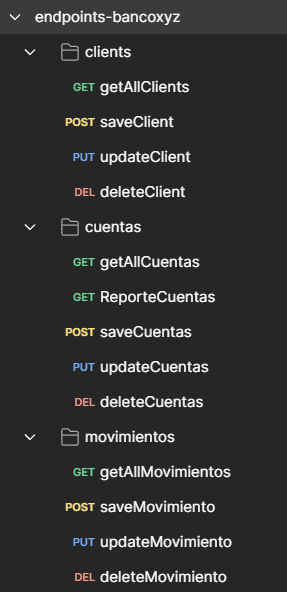

# Proyecto Bancoxyz - Microservicios de Gestión de Cuentas, Clientes y Movimientos

**Autor: Eduardo Conrado**

Este proyecto es una solución de microservicios para la gestión de cuentas bancarias, clientes y movimientos financieros. El objetivo es proporcionar una plataforma para realizar operaciones CRUD (Crear, Leer, Actualizar y Eliminar) sobre las entidades **Cliente**, **Cuenta** y **Movimiento**, además de permitir la consulta de reportes de estado de cuenta.

## Funcionalidades Principales

### F1: Generación de CRUDs
Se han implementado endpoints para realizar operaciones CRUD sobre las siguientes entidades:
- **Clientes**
- **Cuentas**
- **Movimientos**

Los endpoints expuestos para estas entidades son los siguientes:

- `POST /clientes` – Crear un nuevo cliente
- `GET /clientes` – Obtener la lista de clientes
- `PUT /clientes` – Actualizar un cliente existente
- `DELETE /clientes/{id}` – Eliminar un cliente

- `POST /cuentas` – Crear una nueva cuenta
- `GET /cuentas` – Obtener la lista de cuentas
- `PUT /cuentas` – Actualizar una cuenta existente
- `DELETE /cuentas/{id}` – Eliminar una cuenta

- `POST /movimientos` – Registrar un nuevo movimiento
- `GET /movimientos` – Obtener la lista de movimientos
- `PUT /movimientos` – Actualizar un movimiento existente
- `DELETE /movimientos/{id}` – Eliminar un movimiento

### F2: Registro de Movimientos
- Los movimientos pueden ser positivos o negativos, y deben actualizar el saldo disponible de la cuenta asociada.
- Se lleva un registro de las transacciones realizadas para cada movimiento.

### F3: Manejo de Errores
- Si al realizar un movimiento no se cuenta con saldo suficiente, se muestra el siguiente mensaje de error: **"Saldo no disponible"**.
- Se implementa un manejo adecuado de errores y excepciones para capturar y mostrar este tipo de fallos de manera clara.

### F4: Reportes de Estado de Cuenta
- Endpoint para generar un reporte de **Estado de cuenta**:  
  `GET /reportes?nombre=Jose%20Lema&inicio=2025-01-01&fin=2025-02-19`
- Este reporte incluye las cuentas asociadas con sus respectivos saldos y el detalle de los movimientos realizados dentro del rango de fechas especificado.
- La información se retorna en formato **JSON** para su fácil consumo y presentación.

### F5: Pruebas Unitarias

### F6: Pruebas de Integración

### F7: Despliegue de la Solución
El proyecto está configurado para ser desplegado en **contenedores Docker**, utilizando **docker-compose** para orquestar los servicios.

## Tecnologias usadas
* Java 17
* Spring boot 3.4.2
* H2-DB
* Maven
* Junit 5
* Docker & Docker Compose

## Arquitectura
bancoxyz/
├── CuentasMovimientosMicroservice/
│   ├── entity/
│   ├── repository/
│   ├── service/
│   ├── controller/
│   ├── exception/
│   └── comunication/
├── ClientePersonaMicroservice/
│   ├── entity/
│   ├── repository/
│   ├── service/
│   ├── controller/
│   └── comunication/
└── docker-compose.yml

## Requisitos Previos

Asegúrate de tener los siguientes elementos instalados antes de comenzar:
- [Docker](https://www.docker.com/get-started) 
- [Docker Compose](https://docs.docker.com/compose/)

## Instrucciones de Despliegue

### 1. Clonar el repositorio

```bash
git clone <URL_DEL_REPOSITORIO>
cd bancoxyz
docker-compose up --build
```
Esto permite subir RabbitMQ y una instancia de cada microservicio. 
Los servicios estarán disponibles en:

- RabbitMQ:       [http://localhost:15672](http://localhost:15672)
- Clientes:       [http://localhost:8080/api/clientes](http://localhost:8080/api/clientes)
- Cuentas:        [http://localhost:8081/api/cuentas](http://localhost:8081/api/cuentas)
- Movimientos:    [http://localhost:8081/api/movimientos](http://localhost:8081/api/movimientos)
- Reportes:       [http://localhost:8081/api/reportes](http://localhost:8081/api/reportes)

## Pruebas

Para facilitar las pruebas de la API, se incluye una colección de Postman con todos los endpoints configurados.

### Importar Colección
1. Descarga el archivo `endpoints-bancoxyz.postman_collection.json` de la carpeta `/docs/postman`
2. Abre Postman
3. Haz clic en "Import" > "Upload Files"
4. Selecciona el archivo descargado

### Ejemplos Incluidos
La colección contiene ejemplos para:
- Operaciones CRUD de Clientes
- Operaciones CRUD de Cuentas
- Operaciones CRUD de Movimientos
- Registro de Movimientos
- Consulta de Estados de Cuenta
- Casos de error comunes

### Estructura de la Colección


**Autor: Eduardo Conrado**👌